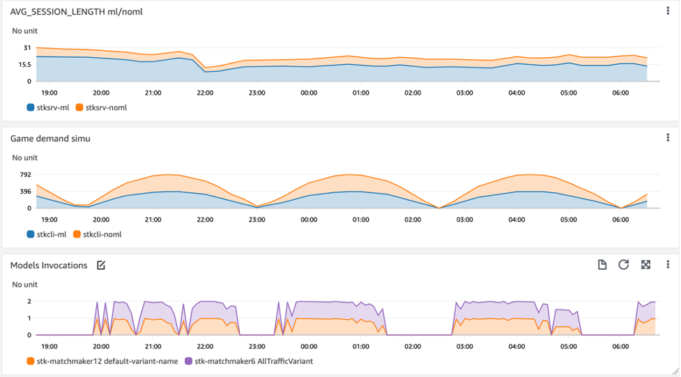

# ML-powered matchmaking using Amazon Aurora ML and Amazon SageMaker

This sample demonstrate a production-grade matchmaking system of the open-source racing game Supertuxkart. It’s powered by Aurora Serverless PostgreSQL. The matchmaking system manages the game sessions and allows matches between players on game servers that maximize player retention. Aurora PostgreSQL provides a SQL interface to the game data. We also show how we augment the data with Autopilot, which lets the game operator explore the database schema and prepare game data using SQL to build optimal models for player match-making without data science skills. Both models and databases are deployed in serverless mode, so we only pay when players play the game.

### Why optimal matchmaking is a machine learning problem
Matchmaking systems for online multiplayer video games pair players with different game scenes to enhance the player experience and increase player retention. Matchmaking techniques currently implement static match policies based on game and player characteristics. However, player attributes don’t always match those of the game scenes (servers), causing the player to exit the game quicker that desired. For example, a player's skill may match several race modes, such as capture the flag or grand prix with casual or experienced players. 

### Why SageMaker Autopilot?
Online game scenes are constantly updated, changing the player's experience and, consequently, their retention. Therefore, game operators need to adjust their match policies to reflect the revised rules that emerge from the latest game scenes. The revised match policies require game operators to investigate game patterns and determine how they impact player retention. In this example, ML algorithms are used to create dynamic match policies based on current game scenes and player preferences. Our ML model also continuously learns from match patterns that are based on existing or novel game metrics. It trains several ML algorithms and suggests or automatically applies the optimal algorithm sequence for new match policies, thereby optimizing player retention in various game scenes.

### Why Aurora ML?
Matchmaking systems keep an inventory of servers, players, and live sessions. Poor player experience results from joining an invalid game server or the wrong game scene. Matchmaking data needs to be consistent while providing data isolation for high concurrency. If we were to query a model outside of the database, you, the game developer, would have to pull player, server, and session information, batch it into chunks, and call the real-time inference endpoint. Finally, the game app aggregates the results and finds the optimal endpoint for the client. 

Aurora ML allows you to skip all of that data moving and simply query servers, players, and sessions against the inference model via a SQL function that batches results and allows SQL-like aggregations in real-time. Your game app is also given minimal privileges between the database and the inference endpoint for high security.  

### Let’s play a game
In this sample, we play the open-source racing game Supertuxkart and deploy player bots that want to play the game and search for suitable game servers. We built a matchmaking prototype that stores servers and session information in a Serverless Aurora PostgreSQL database.

We built a simulation of players who want to play throughout the day. The players present the attributes they want to see in the game. Additionally, each server starts with similar attributes (not identical), and the matchmaking system searches for the most suitable servers based on the players' attributes. We use the [Supertuxkart game attributes](https://github.com/supertuxkart/stk-code/blob/master/NETWORKING.md) such as game mode, game track theme, and difficulty. The system inserts player requests in the [server_sessions](https://github.com/aws-samples/amazon-aurora-call-to-amazon-sagemaker-sample/blob/6ee757b6e434dd9b405ae0e8941d9d9c5d3b9982/multiplayer-matchmaker/aurora-ml-setup/create-match-schema.sql#L41) table and routes players to the game lobby when no match is available. The system also logs every time it matches a server in the [session table](https://github.com/aws-samples/amazon-aurora-call-to-amazon-sagemaker-sample/blob/6ee757b6e434dd9b405ae0e8941d9d9c5d3b9982/multiplayer-matchmaker/aurora-ml-setup/create-match-schema.sql#L23). The session length is updated after the [client exits](https://github.com/aws-samples/amazon-aurora-call-to-amazon-sagemaker-sample/blob/6ee757b6e434dd9b405ae0e8941d9d9c5d3b9982/multiplayer-matchmaker/game-cdk/game-server/linux-aarch64/serverfiles/cli-sigstop.sh#L16) the game. 

### Using Autopilot to train the matchmaking model
We first export the data to Amazon Simple Storage Service (Amazon S3) after setting up access to write to an S3 bucket from our Aurora database instance. See the following code:

```sql
SELECT aws_commons.create_s3_uri(
   'stk-matchmaking',
   'server_sessions_may_export',
   'us-west-2'
) AS s3_uri_1 \gset

SELECT * FROM aws_s3.query_export_to_s3(
'SELECT s_location,s_track,s_tracktheme,s_mode,\
s_difficulty,p_location,p_track,p_tracktheme,\
p_mode,p_difficulty, p_skill,EXTRACT(MINUTE FROM session_length) AS session_length 
 FROM server_sessions 
 WHERE session_length IS NOT NULL AND p_skill IS NOT NULL',:'s3_uri_1', OPTIONS:='header true,format csv, delimiter $$,$$');
```

The features we may want to use are: `s_location`, `s_track`, `s_tracktheme`, `s_mode`, `s_difficult`y, `p_location`, `p_track`, `p_tracktheme`, `p_mode`, `p_difficulty`, and `p_skill`. We don’t know which feature is going to help the model to predict the maximal session length, so we’ll see how Autopilot can help us. We create an Autopilot experiment with basic settings using the Autopilot console.

### Configure the SQL function for querying the model from Aurora 
The following SQL function defines the parameters needed for invoking the model we trained with Autopilot. It also references the endpoint name, stk-matchmaker9, in our case. We chose to return a VARCHAR type to allow flexibility in manipulating the model specifics. For example, XGBoost returns session_length integer, and linear learner regression model returns the pair of session_length integer and accuracy float. In the SQL function, we show how we manipulate the model prediction results to retrieve the optimal server for the client. 

```sql
CREATE EXTENSION IF NOT EXISTS aws_ml CASCADE;
CREATE FUNCTION estimate_session_length_xg(
in s_location CHAR(16),
in s_track CHAR(24),
in s_tracktheme CHAR(24),
in s_mode CHAR(24),
in s_difficulty INT8,
in p_difficulty INT8,
in p_location CHAR(16),
in p_track CHAR(24),
in p_tracktheme CHAR(24),
in p_mode CHAR(24),
in p_skill CHAR(24),
max_rows_per_batch INT DEFAULT NULL,
out estimate VARCHAR) 
AS $$
   select aws_sagemaker.invoke_endpoint('stk-matchmaker9',NULL,
    s_location,s_track,s_tracktheme,s_mode,s_difficulty,
    p_difficulty,p_location,p_track,p_tracktheme,p_mode,p_skill)::VARCHAR
   $$ LANGUAGE SQL PARALLEL SAFE COST 5000; 
```

### Query the model from Aurora SQL
We test the model by analyzing it before embedding the query in the game client application. The following query retrieves the matches and the actual session length the bots played in the game simulation. We queried the model deployed by Autopilot aliased by estimate_session_length_xg. The query results show the correlation between predictions made by the model and the actual player time. 

```sql
SELECT 
estimate_session_length_xg(
s_location,s_track,s_tracktheme,s_mode,s_difficulty,p_difficulty,p_location,p_track,p_tracktheme,p_mode,p_skill) as xg_predicted_session_length
EXTRACT(MINUTE FROM session_length) AS actual_session_length 
FROM server_sessions where session_length IS NOT NULL 
AND updated_at>NOW()-'10 hour'::INTERVAL and updated_at<NOW()-'5 hour'::INTERVAL 
LIMIT 5;
```

```bash
 xg_predicted_session_length | actual_session_length 
-----------------------------+-----------------------+
 59                          |                    44
 58                          |                    49
 7                           |                    12
 7                           |                    12
 9                           |                    12
(5 rows)

```

Next, we embed the matchmaking query in the client. The outer query returns the endpoint that the model predicted to yield the longest session. Note that we query the model (estimate_session_length_xg) with the server attributes such as location, game track, game theme, game mode, and game difficulty from the ready servers (is_ready=1) with the player attributes denoted by $player_prefix. See the following code:

```bash
endpoint=
`psql -A -q -t -w -c 
"/*start-client.sh-test-model*/
 select endpoint 
 from (
select endpoint,
max(estimate_session_length_xg(
location,track,tracktheme,mode,difficulty,
'$player_difficulty','$player_location','$player_track','$player_theme_track','$player_mode','$player_skill')::NUMERIC) as estimate 
from servers 
where is_ready=1 
and max_players>num_active_session+"$NETWORK_AI" 
and created_at>NOW()-'24 hour'::INTERVAL 
group by endpoint 
order by estimate 
desc limit 1
) as t;"`
```


### How to use the code sample
The system includes a Kubernetes cluster setup that runs the game server, player bots, and the load simulator Docker containers. It also contains the setup of an Aurora database for storing the server and session information. 

1.	Deploy the Kubernetes cluster with eksctl: 

```bash
eksctl create -f ./multiplayer-matchmaker/game-k8s-specs/eksctl-cluster.sh
```

2.	Set up your node (EC2 instances) cluster auto scaler using Karpenter. We used the following provisioner spec.
3.	Deploy the Aurora PostgreSQL cluster:

```bash
cd ./multiplayer-matchmaker/aurora-pg-cdk
npm install -g aws-cdk
AWS_ACCOUNT_ID=`aws sts get-caller-identity --query Account --output text`
AWS_REGION=us-west-2
cdk bootstrap aws://$AWS_ACCOUNT_ID/$AWS_REGION
cdk deploy
```

4.	Populate the database credentials for the game server and player bots. Pull the secrets from AWS Secrets Manager and populate game-k8s-specs/db-creds.secrets. For example, see the following code:

```bash
cat db-creds.secrets 
PGHOST=myhost.rds.amazonaws.com
PGUSER=myuser
PGPASSWORD=mpass

cd ./multiplayer-matchmaker/game-k8s-specs/
./db-creds-create.sh
```

5.	Deploy the game server CDK to create the game server, game client, and the load simulator Docker images. 
6.	Deploy the workload:

```bash
kubectl apply -f game-k8s-specs/stk-server-match.yaml
kubectl apply -f game-k8s-specs/stk-client-match.yaml
kubectl apply -f game-k8s-specs/appsimulator.yaml 
```

7.	Let the workload run for a few hours, and observe the session and server info populated in the database. Then export the data to Amazon S3 and train the data using the steps described earlier. 
8.	Deploy the client application that uses the ML function:

``` bash
kubectl apply -f game-k8s-specs/ stk-client-ml-match.yaml
```

9.	Observe the Amazon CloudWatch metrics in the CloudWatch namespaces appsimulator and supertuxkart. 

The chief metrics we use to assess the model performance are stksrv-ml or stksrv-noml. The following example shows that matches made by the model (stksrv-ml) were 62% longer than the one made with no ML (stksrv-noml). We also provide the game client demand simulation by clients matched using the model inference (stkcli-ml) and without (stkcli-noml). Finally, we show the concurrent model invocations made by game clients. The first figure (AVG_SESSION_LENGTH ml/noml) shows the session length of matches made by the model (ml) and without the model (noml). The second figure (Game demand simu) shows the equal load between the two client types, ml and noml. The last figure (Models Invocations) shows the calls made to the model throughout the simulation. 


